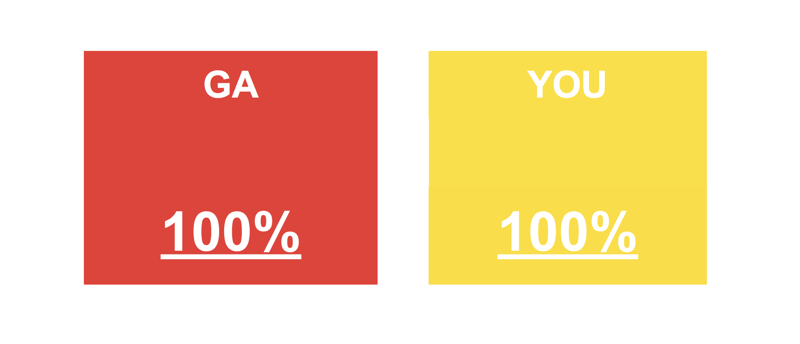
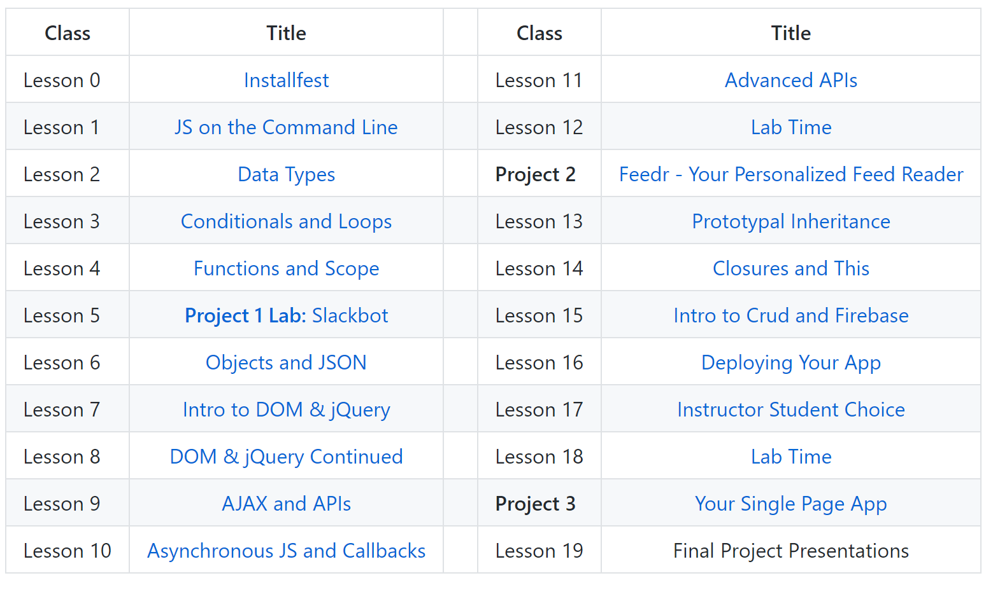

## Course "Home Room"

* [https://git.generalassemb.ly/kjams/JSR_4_2020](https://git.generalassemb.ly/kjams/JSR_4_2020)
* **Bookmark it!**
* Source of all information about the course

## Introductions!

Please be prepared to tell the class the following:

* Your Name
* Where in the World are You?
* Why you're taking this course
* A fun fact...or your favorite childhood cereal!

---

# Classroom Culture

## "Live Online"

* Welcome to the "Live Online" classroom! (Old name: "Remote" classroom)
* Different from a plain "Online" classroom, where there may not even be a live instructor!
* [GA Live Online Classroom Culture Slides](https://docs.google.com/presentation/d/1FdCp8jKriivuj94Mevq53pRr8ZGNsZOPYMuIaPyJxZw/edit?usp=sharing)

## Communication

### Zoom

Smile! You are expected to **be on camera**! This is just like being in a real classroom.

### Slack

Slack is the primary method of communication for the course.

We encourage you to ask questions on the Slack channel (instead of asking privately) so that everyone can benefit from the answers. If you have a question, chances are others have the same!

We typically respond fastest via Slack, and we typically respond slowest via email.

Please keep in mind that outside of class/office hours we are at our day jobs/with family or otherwise not at our computers, so may take longer to reply.

## Expectations

* What the heck did you sign up for?
* This is an **Accelerated Learning Environment** like all GA courses!
   * No programming experience required. We're starting from scratch, but it's going to be **fast**!
   * We *cover more stuff and go faster than a college course*
* This is not a class where you can show up and watch like a TV show
* There will be a lot of collaborative work in the classroom -- many of the exercises will be completed in small groups or pairs.
* There will also be **a lot** of work outside class!

## Drop The Ego

* Trait of Best Beginner Programmers: ***Spirit of Exploration***
   * Indeed, not just beginners, but all programmers
* Ask questions and ask for help
   * There are no stupid questions, you're beginners!

## Don't be an A**hole

* Be on-time to class
* Self-awareness
* Common sense
* Decency
* Respect each other's time

---

# What to Expect for Class
## Unit Breakdown

| Class | Title | Project Prompt | Project Deadline|
| --- | :---: |  --- | :---: |
| **Unit 1: Fundamentals of JavaScript** | Lessons 0 - 6  | Slackbot: Introduced in Lesson 5| Slackbot: Due during Lesson 6-7|
| **Unit 2: The Browser and APIs** | Lessons 7 - 12 | Feedr: Introduced at the end of Lesson 11 and during Lesson 12 Lab Time| Feedr: Due before start of Lesson 15 |
| **Unit 3: Persisting Data and Advanced Topics**| Lessons 13 - 16 |Final Project: Introduced at end of Lesson 14| |
| **Unit 4: Building and Deploying Your App**| Lessons 17 - 18 ||Final Project: Due during Lesson 19|

# Lesson Breakdown
Links added day of class

## Before Class

* Be present in Slack
* Join the Zoom Room
* **Turn on your Camera**
* Mark your attendance in Slack where prompted

## During Class

* Work through today's topics
* Preview homework
* End of class: **Fill out exit tickets**

## Between Classes

* Review class notes
* **Do homework**
* Visit office hours for help on homework!
* Ask questions on Slack!

---

# Exit Tickets  **IMPORTANT**

* A short survey to help us better understand your learning growth
* Reviewed by the instructional team after every class

---

# Graduation Requirements

To qualify for a **Letter of Completion**, students must adhere to all the academic policies outlined in the [Course Catalog](https://generalassemb.ly/regulatory-information).

## Attendance

If you miss more than 3 days *regardless of reason*, you will not successfully complete the course.

You may have up to 3 **excused absences**. If you will have to miss a class due to an emergency, **notify the IA via Slack ahead of time**. Unexcused absences are **not allowed**.

You may have a 48-hour grace period for notifying the IA in case of emergency. Acceptable excuses include:

* Illness, death or critical illness to you or a family member or significant other
* Critical life emergency
* Religious observances
* Other extenuating circumstances as outlined in the Course Catalog

## Tardiness

If you arrive after class starts, you are late and will accrue one late arrival. If you leave before class ends, you will accrue one early departure. Three late arrivals or early departures = 1 absence.

## Complete Homework Assignments on Time

Assignments are due on the date/time indicated on the assignment. They will be graded by the IA/TAs about a week after submission. If the IA/TA extends to you a chance to re-submit the assignment after feedback, you will have 3 business days to do so.

You may have up to a three-day grace period for extenuating circumstances (see above) if you get approval before the due date.

It’s strongly encouraged to work with your co-students outside of class on homework and assignments, but you will still turn in individual assignments.

To qualify for a Letter of Completion, you must satisfactorily complete at least 80% of the assigned homework.

## Complete Final Project

You'll complete a final project, asking you to apply your newly acquired skills to a problem of your choice.

You will have about two weeks to work on your final project. At the end of the course, you will present your results to your peers!

As the project is two weeks in duration, no grace periods apply. You are expected to start your project on time, work steadily towards completion, and meet expectations for the final project. Please communicate with us if any extenuating circumstances develop so that we can help you manage your time accordingly.

To qualify for a Letter of Completion, you must satisfactorily complete the final project and present it to your classmates.

---

# Class Recordings

Class recordings are typically available the day after class -- they take a few hours to process after each class is finished.

Recordings are provided as a **courtesy** only, on a best-efforts basis, and are not an official part of GA's service delivery. They are not a substitute for attending class, and are meant for review and supplementary use.

You will find them on the **Course Schedule** once they are processed and available, under the **Recording** column.
