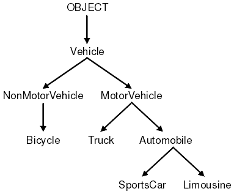

## JS Developer Intro

The following exercises are to get you aquatinted with:
- Your peers!
- JavaScript
- Sharing information/questions in slack
- Researching like a developer
- Building the foundation of your final project
- Building a classroom culture (what type of classroom are we?)

### Functional & Object Oriented

**Object Oriented & Functional Programming** 
OOP focuses on structuring imperative code. It creates models of various concepts in a given problem area, then applies them. These models ("objects") are given functionality ("methods") that enable them to perform various actions; each object can also hold information. The fundamental unit in OOP is the object, which can itself contain further objects, like a Russian Matryoshka doll. The idea is to make it easier for human programmers to visualize the program by tying the program to concrete things, which helps the programmer group things logically. The fundamental thing to remember is that in object-oriented programming, everything is an object and every object has methods that allow the programmer to access its functionality.

  

**Functional Programming** 
treats the problem area as a sequence of equations ("functions")--essentially, a progression of definitions that lead to the answer. The information begins as a number of axioms and culminates in the answer. (Think of it as a logical argument that ends in what you see on the screen.) Functional programming borrows many concepts from formal mathematics, and, as in mathematics (and unlike imperative programming or OOP), it usually does not save data between steps. The fundamental unit in functional programming is the function, which can perform operations as well as produce further functions.

  

**🐕 Activity 1: Research 🐕**

> For which style of programming is JavaScript used? Share your answers in slack.

---

### Web Development: The process of building sites and applications for the Web.

**Front-End Development:** The development of client / browser code (HTML, CSS, JS), i.e., what the user sees and interacts with.

**Back-End Development:** The development of server-side code that handles such functions as routing, data handling, and databases (Ruby, Python, Java, Javascript), i.e., the “stuff behind the scenes” that makes Web applications work.

---
### Tool Research
Your final project will be to build a web app of your choosing. This is a great way to showcase your skills and add to a portfolio. To build a web app, you'll have to learn a framework. Let's take some time to survey the existing JS frameworks out there.

**🐕 Activity 2: Tool Research 🐕** 

Tool research, for this course we get to pick one class to focus on a tool/framework to learn. Take this time to search for a list of potential tools you'd like to learn. Some popular ones are:

- Node & Express
- Vue
- React

Some questions to answer:

- How does this framework help you?
- What do you need to know? *(always a great place to start)*
- Are you more focused on Front-End, Back-End, or Full-Stack?
- What would you like to be able to do at the end of this course?
  - get a job
  - learn on your own
  - build a certain product
  - get into school

> Share your answer in slack
  - framework
  - reason
  - goal
  - Any questions?

---

### WWW & The Internet

**🐕 Activity 3: Team Scavenger Hunt (Trying out breakout rooms!) 🐕** 
Find the answer to each question and be ready to provide the source that supports your answer!

- True or False: Sharks love to chew on internet cables
- How many root name servers are there? (bonus: what is a root name server?)
- Find the New York Times ip address
- Find the coolest map of the internet and share in slack
- Who invented the internet and when?
- Who invented the world wide web and when?

---
### Client Server Model

**🐕 Activity 4: Inspector Tools 🐕** 
Using inspect tool:
- Find examples of client side html, css, and js on a website of your choice.
- Can you find examples of when server side code was shared with a client(s)?
- Sketch out the client-server model & share in slack (can't use the inspector tool here)
- We all need some good news! Edit the front cover of a website of your choice, take a screen shot, and share in slack to help make everyone's day!
