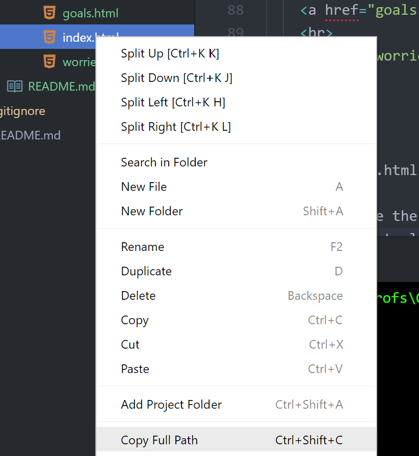
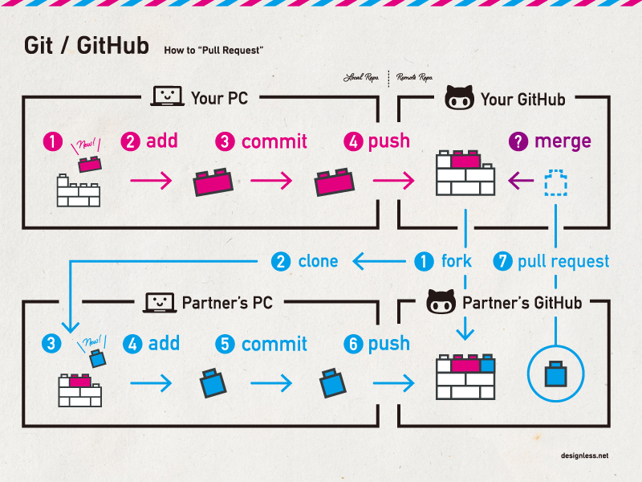

#  Command line (2:45)

| Timing | Type |Topic|
| --- | --- | --- |
| 20 min | [Opening](#opening) | JavaScript & Web Technology |
| 45 min | [Codealong](#codealong1) | Introduction to the Terminal|
| 60 min | [Codealong](#codealong2)  | Introduction to Git/GitHub  |
| 30 min | [Codealong](#codealong3)  | JS in the Terminal with Node |
| 10 min | [Conclusion](#conclusion)| Final Questions & Exit Tickets |

### Learning Objectives

- Use the most common commands to navigate and modify files / directories via the terminal window.
- Initialize a local Git repository and push/pull changes to a remote Git repository.
- Run basic JavaScript script on the command line using Node.

### Class Notes
[Github, Terminal, and variable notes](https://git.generalassemb.ly/kjams/JSR_4_2020/blob/master/unit-1/01/assets/cmd_line.pdf)

### Preparation
*Before this lesson, students should already be able to:*

- Summarize the client-server model.
- Installing and configuring Node.js, npm, Git, and other command line tools.
- Writing pseudocode and think programmatically.
- Using HTML and CSS to create static Web pages.

---
## Hello's
- Were you able to personalize your IDE/Terminal?
  - if so, what did you do?
  - if not, do you want help?
- Lingering Questions?

## Introduction to the Terminal (45 min)

We learned how to execute some scripts on the command line during Installfest. You will soon find that the command line is the heart of your operating system. Almost anything you can do from a GUI (Graphical User Interface), you can also do from the command line, but FASTER! We'll learn how to navigate computer files and folders using the terminal; this will help us begin pushing our projects to GitHub.  

#### Command Line Basics

Here are some important UNIX commands to know as you're working on the terminal.


| Command | Description | Command| Description |
| --- | --- | --- | --- |
| `ls` | **L**i**s**t the contents of the directory | `subl` | Open sublime text|
| `cd` | **C**hange **d**irectories| `pwd`| **P**rint **w**orking **d**irectory |
| `mkdir` | **M**a**k**e **dir**ectory | `say`| Make your computer talk |
| `rmdir` | **R**e**m**ove empty **dir**ectories  | `open`| Open a particular file in their default application|
| `rm` | **R**e**m**ove files or directories | `./`  | The current folder|
| `touch` | Create an empty file | `../`| One folder above your current working directory
| `echo` | Return a string |  `~/` | The home folder  |

**Get familiar with the basic commands on the terminal!**


1.  Navigate to your Documents Folder from your Root Directory. ```cd ~``` and then ```cd Documents```

2. Create a directory named Advanced_JS.  ```mkdir Advanced_JS```

3. Change into this directory. ```cd Advanced_JS```

4. Create a file named "index.html" using the touch command. ```touch index.html``` Windows: ```type nul > filename.txt```

5. Open "index.html" in your IDE

6. Getting use to the IDE

7. Using HTML comments, type "This is how you should take notes in class." (i.e., `<!-- comment -->`).

8. Create an empty directory within the Advanced JS folder and remove it. ```mkdir test_folder ``` and ```rmdir test_folder ```

<a name="codealong1"></a>


## Make a Basic Web Site

**🐕 Exercise One 🐕**
> Create a folder to house all of your work for JSR. The location is up to you! Inside this folder, create another folder called Sites. This is where we will be working today and ultimately deploying a website.

Complete the following instructions below in the Terminal application. Below is a tree of the file structure the steps are asking for.

```txt
JSR
  └───Sites
      └───Goals
          └───index.html
          └───worries.html
          └───goals.html

```

1. Create a folder in your ~/Sites/ folder titled goals.

2. Once inside that folder, create three empty files:
  - goals.html
  - worries.html
  - index.html

3. Open this folder in Atom

4. Paste the following contents into index.html:

  ```javascript
  <html>
  <head></head>
  <body>
    <a href="goals.html"></a>
    <br>
    <a href="worries.html"></a>
  </body>
  </html>
  ```

5. Open index.html with your browser and make sure you see your goals and worries.
- [ATOM package to make life easy](https://atom.io/packages/open-in-browser). Make sure to restart ATOM once you have installed a package

- OR, you can do it the manual way as below:

<center></center><br>

**🐕 Activity 2 🐕**
> If you have the time in class, start to make this website your own! Add as many pages as you like, fill in content that you like, try to use what you used in the pre-work to fill out these pages.

**Extension**
> Want to make your website responsive and professional looking with ease? Say no more, check out how to add [bootstrap](https://getbootstrap.com/docs/4.4/getting-started/introduction/) to your project and read the [component documentation](https://getbootstrap.com/docs/4.4/components/alerts/) to start using. See if you can't add bootstrap to your website.

---


<a name="codealong2"></a>
---

# Introduction to Git/GitHub (40 min)


#### What is Git?

Git is a tool that:
* Primarily stores code, but can also store files, like Dropbox or Google Drive
* Maintains each file’s history, including all document changes (like Apple's Time Machine software)
* Is now commonplace in any company that employs engineers!!!!

#### Why is Git So Popular with Developers?

* Because Git stores a history of the code, it allows developers to “go back in time” if something breaks
* Git tracks changes so you can see who worked on what

#### What is GitHub?

[](https://www.youtube.com/watch?v=w3jLJU7DT5E)

GitHub is a platform that:
* Facilitates the sharing and managing of code, making it easy for multiple engineers to collaborate on the same project.
* Hosts files on the Web so you can share the finished product with other people

We setup our GitHub account in the last lesson.

#### Why is GitHub So Popular with Developers?


* Much like Dropbox or Google Drive lets multiple people collaborate on the same document; GitHub allows this for code
* GitHub allows team members to provide feedback on the code, which potentially increases code quality

#### How Does GitHub Work in a Collaborative Environment?



GitHub's collaborative process can work many different ways, but this is the most common:

1. Each GitHub project has a Git _repository_, or _repo_. Engineers joining a team start by "cloning" the repo. That is, they copy the Git repo from GitHub's cloud and save it in a local folder.

2. The main, stable version of the codebase is on the default "branch" in Git, which is called `master`.
  - Engineers typically create new branches for certain features or portions of the code they will work on, but we won't be creating branches in this class.


3. As engineers work on a project, they "add" and "commit" their changes. This establishes a saved version of a project and creates a history of the previous iteration. With these saved versions, engineers are able to revert to an earlier version if an issue arises that cannot be fixed.

4. If multiple engineers are working on a project, other engineers can review the committed code and provide feedback. For this class, the instructors will be reviewing and providing feedback on your code.
- We will be working with our own default `master` branch for each of our projects.

#### Git/GitHub Vocabulary

* **Git** - A version control program that saves the state of your project's files and folders; It takes a "snapshot" of what all your files look like at that moment and stores a reference to that "snapshot".

* **Repository** - A central location in which data—typically project-related—is stored and managed
* **Clone** - To download data from the cloud to your local machine (laptop, computer, etc.)
* **Commit** - To save a version of your project to Git
* **What is the difference between Git and GitHub?**
> Git is a distributed version control tool that can manage a development project's source code history, while GitHub is a cloud based platform built around the Git tool
  * [source one](https://www.theserverside.com/video/Git-vs-GitHub-What-is-the-difference-between-them)
  * [source two](https://blog.devmountain.com/git-vs-github-whats-the-difference/)

---
### GitHub Exercise- First Website Code-Along
*Creating and pushing to your first repository**

[Follow me to success!](https://pages.github.com/)

> If using an enterprise github account through GA, the steps to view your site might be a bit different.
  - make sure site is public
  - enabled pages for repo
  - the url to see site is as follow -> https://pages.git.generalassemb.ly/username/username.github.io/site/

---

## JS (30 min)
<a name="codealong3"></a>

### In the Terminal

You may be more familiar with JS in the browser, but in order to get used to working with the terminal—and thinking like a programmer—we’ll be using JS on the command line during the first unit of this class. Remember when we installed Node and npm? We'll be using these tools to make scripts run in the terminal.

---

### Executing a JS program: Codealong

Starting next class, we'll be creating our own JavaScript files and building out from it. Before we dive in, though, we need to explore the power of the terminal and run JavaScript inside of it.

The terminal is to a programmer what a Swiss Army knife is to a survivalist. It’s a multi-faceted tool that we will always be using to move our projects forward. And, for now, it helps us focus our learning. The computer has always had a text-only interface. Some of you may remember DOS or the early text-only games before complex graphical interfaces. The terminal is a tool from that era that professional developers still use every day.

#### Part 1: Write and execute some code in a file!

- DRY
- Comments
- Style
- Simple

#### Part 2: Let's do some basic math!

- Algorithm
- Basic variables
- How does a program run?

#### Part 3: Intro to Scope

- Keep it simple!
- Reusability
- Problems?


## Conclusion (10 min)
<a name="conclusion"></a>
#### Review

* Understand what GitHub does and why we'll be using it.
* Understand how we will be using Node in the class.

#### The Developer Mentality

Here are some tips that you'll want to keep in mind as you continue coding!

  * Choose the right OS, editors and tools for your projects. Remember to do your research.
  * Leverage the online community's vast libraries and documentation.
  * Be efficient: Use the keyboard as much as possible instead of the mouse.
  * If you find yourself doing the same thing repeatedly, automate it.

#### Further Resources

* [iTerm2](http://iterm2.com/)
* [Review Git](https://www.codeschool.com/courses/try-git)

#### Over the weekend *optional*
- Try making your website awesome. Add some HTML, CSS, and try JS if you really want to push yourself.

- Check out bootstrap and see if you can get it up and running for your site.
  > Want to make your website responsive and professional looking with ease? Say no more, check out how to add [bootstrap](https://getbootstrap.com/docs/4.4/getting-started/introduction/) to your project and read the [component documentation](https://getbootstrap.com/docs/4.4/components/alerts/) to start using. See if you can't add bootstrap to your website.

- Continue to personalize your IDE and terminal
- Sign up for [Codewars](https://www.codewars.com/) and try out some of the 8 kyu problems
- Check out [Leetcode](https://leetcode.com/) and try some of the first problems
